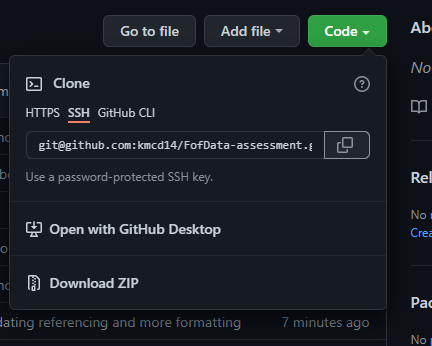
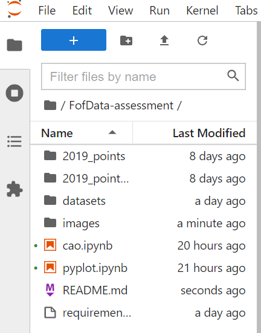

#  <b>FUNDAMENTALS OF DATA ANALYSIS ASSESSMENT</b>

<br>


<br></br>
This respository contains Jupyter notebooks and other relevant files relating to the module assessment for Fundementals For Data Analysis.
 This `README.md` file contains the documentation for technologies and libraries used for the project. 


All notebooks and all other relevant files can be found at: https://github.com/kmcd14/FofData-assessment.

<br>

---

<br>
<h2><u>Table of Contents</u></h2></summary>
<br>
  <ol>
    <li><a href='#Description'> Description</a></li>
    <li><a href="#Script">How To Get The Respoistory on Your Machine</a></li>
    <li><a href="#Jupyter">Running Jupyter Notebook</a></li>
    <li><a href='#Technologies_Used'>Technologies Used</a></li>
    <li><a href="#Libraries_Used">Libraries Used</a></li>
    <li><a href="#credits">Credits</a></li>
    <li><a href="#contact">Contact</a></li>
    
  </ol>
<br>

---

---

<br>
<h2><b><u><p id='Description'> Description</b></u></p></h2>
<br>


 <h3><u> Pyplot </u></h4>

<br>

The notebook `pyplot.ipynb` is in relation to the matplotlib.pyplot assessment for the module. 

The aim of this notebook is to provide a clear and concise overview of the Python package ```matplotlib.pyplot```. This will be achieved by reseaching the package and demonstrating it's functionality through a choice of three of the plots the package provides.

<br>

 <h4><u> Objectives: </u></h4>
 <ul>
  <li>Explain the overall purpose of the package.</li>
  <li>Explain the use of three plots the package contains. </li>
  <li>A clear and informative READMe file.</li>
  <li>A requirements.txt file.</li>
</ul>

<br>

I enjoyed undertaking this project as it enabled me to develop an appreciation for `matplotlib` and its capabilities. For example, up until this project I believed a plot to be the correct term but I now know about the anatomy of a figure. 

Images are a powerful form of communication and are an integral part of data analysis. 
It is important that we can visualise our data for others who may not be versed in data or programming so they can understand our findings. It is often easier to digest an image than blocks code or digits. Additionally, by visualising our data it allows us to see patterns that we may not have otherwise noticed.

<br>

In the future to further exapand on this project and to continue my leaning and development, I would like to explore `matplotlib`'s object oriented interface. The `pyplot` module is a state machine interface. This means that the current figure is automatically created, updated and edited with method passed. This makes `pyplot` simple, easy and efficent to use.  Additionally,  `matplotlib` has an objected orientated interface. 
Using an object-oriented approach gives you total control of a figure and all the elements which it contains. method is to create figure objects and then call methods off of it. 

<br></br>

<h3><u> CAO Points </u></h4>

<br>

The notebook `cao.ipynb` is in relation to the CAO Points part of the assessment for the module. 


The Central Applications Office (CAO) is responsible for the processing of applications of students who wish to study at third level in the Republic of Ireland.  The entry to these courses are based on a points system, known as CAO points.  (some may have extra additionally requirements e.g. portfolio).  These entry points aren't set and therefore, may vary and change year on year. 


The aim of this notebook is to provide a clear and concise overview of how to retrieve data in various forms (html, excel and pdf in this case) and load it into a pandas dataframe. Using this dataframe conduct a comparison of the CAO points for the years 2019, 2020 and 2021. This will be achieved by using pythong, the python package pandas and other visualisations and plots. 


<br>

 <h4><u> Objectives: </u></h4>


- Give a clear and concise overview of how to:
    -  Retrieve the CAO points from the CAO website.
    -  How to load the CAO points into a pandas datareame.
- Using pandas, conduct a detailed comparison the 2019, 2020 and 2021 CAO points.  
- A clear and informative READMe file.
- A requirements.txt file.


<br>

I found this project quite challenging at times but it was equally rewarding when I figured out how to things. This project definely helped develop my research skills, figuring out how to find soloutions to problems I was having such as reading data from a PDF. 

Although I found it difficult at times I appreciate how this gave an insight into real world situations where data isn't clean and easy, there are many road blocks and finding ways to overcome them is as much a part of data analysis than writing the code itself. I hope you will be able to see this in the `cao.ipynb` notebook. 


<br>

In the future to further build and exapand on this project and continue my developing my skills, I would like to try and incorparate some machine learning and see if it is possible to predict future points changes.


<br>


---

<br><br>

<h2><b><u><p id='Script'> How To Get The Respoistory on Your Machine</b></u></p></h2>
<br>
<ol>

<li>Using your browser navigate to the repository:  

https://github.com/kmcd14/FofData-assessment.

<br> </il>




<br>
<li>Under clone, copy the repository address, as seen in the above picture, using either SSH or HTTPS</li>
<li> Open your teminal.</li>
<li> Naviagte to the location where you want to store the cloned directory.</li>
<li>In the terminal type the command:

<br>

    $git clone git@github.com:kmcd14/FofData-assessment.git


</li>
<li>Press enter. The cloned reposistory is now on your machine.
</li>
</ol>

<br></br>

---
<br></br>
<h2><b><u><p id='Jupyter'>Running Jupyter Notebook</p></b></u></p></h2>

<br>

The easiest way to run the notebooks is by python installed via the Anaconda distribution. 
Anaconda is the most widely used python distribution in data science fields as it comes preloaded with most of the most popular packages and tools. You can find out more about Anaconda and how to install it here
  https://docs.anaconda.com/.

<br>

You can forgo downloading Anconda and install each package indvidually in the python shell. A full list of requirements for each notebook can be found in the `requirements.txt` file in this repoistory. Full details and links to each package used can be found further down in this README. 

<br>
Additionally, if you wish to view the notebook without having to install additional requirements, please click on the following badges to be redirected in your browser. 

<br> </br>

`pyplot.ipynb`

[](https://nbviewer.org/github/kmcd14/FofData-assessment/blob/main/pyplot.ipynb)

<br> </br>

`cao.ipynb`

[](https://nbviewer.org/github/kmcd14/FofData-assessment/blob/main/cao.ipynb)

<br>
<br>

### Opening and Running The Notebook

<br>

  
  - From the command line navigate to the folder you have cloned the repository to.
  - Type `jupyter lab`  or `jupyter notebook` into the command line and press enter to lauch the the jupyer interface.
<br></br>
  
  <br></br>

  - In the side panel you will see all files in the respository as seen in the above image. 
  - Click on `pyplot.ipynb` or `cao.ipynb` to open the notebook.
  - To run the code in a cell hold down the `shift key` and press `enter` or click `Kernal` in the top toolbar and run all cells.
  - To change between edit and read mode at any time press the `ESC key`.
  - When you have finished, shut down the kernal via file > shut down in the browser, close the browser and press Press `Ctrl + C` on the command line to terminate the programme.

<br></br>
Note: 

If the jupyter interface doesn't auctomatically open in your browser try specifying the browser eg:

      jupyter lab —browser=chrome


Jupyter Notebook has a full troubleshooting guide which can be found:
 https://jupyter-notebook.readthedocs.io/en/stable/troubleshooting.html
<br></br>


---

<br></br>
<h2><b><u><p id='Technologies_Used'> Technologies Used:</b></u></p></h2>
<br>
<b><u>Google Docs:</u></b> an online word processor used to write my documentation before transfering into this README file. 

https://www.google.com/docs/about/
<br></br>
<b><u>Anaconda:</u></b> the easiest way to perfrom Python data science machine learning on Windows, Linux and Mac OS. This script was created using Version 4.9.2. https://www.anaconda.com/distribution/
<br></br>
<b><u>Python:</u></b> an interpreted, object-oriented, high-level programming language with dynamic semantics. This script was created using Version 3.8.5. 
https://www.python.org/
<br></br>
<b><u>GitHub:</u></b> is a code hosting platform for collaboration and version control. https://github.com/
<br></br>
<b><u>Jupyter Lab/Jupyter Notebook:</u></b> a web-based interactive development environment for Jupyter notebooks, code, and data. https://jupyter.org/
<br></br>
<b><u>NBViewer:</u></b> a web application which enables you enter the URL of a Jupyter Notebook file, renders that notebook as a static HTML web page, and gives you a stable link to that page which you can share with others. https://nbviewer.org/

<br></br>
<br></br>


---

<br></br>
<h2><b><u><p id='Libraries_Used'>Libraries Used:</b></u></p></h2>

Python has a vast and continuously growing library to choose from which makes it perfect for data analysis, such as Numpy and Pandas. It is a robust, flexible and efficient language which provides many solutions and avenues to approach and solve problems.

<br>

<b><u>A full list of each notebooks requirements can be found in the 
`requirements.txt` file in the project reposistory. </u></b>


<br>

<u><b>Numpy</b></u> is a Python library used for working with arrays. It produces a narray object. Numpy arrays are faster and more efficient than using python lists. It does this by storing arrays in one place in memory, so they can be accessed and manipulated quickly http://www.numpy.org/

<br>

<u><b>Mathplotlib</b></u> is a python library used to create plots, graphs, charts etc. https://matplotlib.org/

<br>

<u><b>Pandas</b></u> is a data manipulation tool built on Numpy. It’s key structure is the dataframe. You can think of a dataframe as a spreadsheet or table but, dataframes as are more efficient and powerful and are an integral part of Python and Numpy. Pandas will allow us to select specific rows and columns within the dataframe. https://pandas.pydata.org/

<br>

<u><b>Scikit-Learn</b></u> is a library in python that provides many unsupervised and supervised learning algorithms. It is one of the most popular and best known packages to do so. The package which provides users with efficient versions of a large number of common algorithms used in machine learning. It also features helpers to fetch larger datasets commonly used by the machine learning community to benchmark algorithms on data that comes from the ‘real world’. https://scikit-learn.org/

<br>

<u><b>Seaborn</b></u> is based on matplotlib and is also used to create data visualisations. “It provides a high-level interface for drawing attractive and informative statistical graphics.” https://seaborn.pydata.org/

<br>


<u><b>Camelot</b></u> a Python library that can help you extract tables. Camelot has a number of dependencies which much be installed for it to work - ghostscript and tkinter (automatically inculded in python 3.7 or later) - and additonally needs to be downloaded directly from the camelot website. Please see the following link for full details. 
https://camelot-py.readthedocs.io/en/master/user/install-deps.html


<br>

<u><b>Ghostscript</b></u> is an interpreter for PostScript and Portable Document Format (PDF) files. (Camelot dependency). https://www.ghostscript.com/


<br>

<u><b>If your system does not have these libaries installed enter the below command from the command line: </b></u>

<br>

```
    $pip install <library name>
```

<br></br>

---

<br>

<h2><b><u><p id='credits'>Credits:</b></u></p></h2>

To my Fundementals of Data Analysis lecturer  Dr. Ian McLoughlin for his lectures and tutorials on the retrival and formatting of the CAO points in the `cao.ipynb` notebook. 

Especially on how to deal with the 2021 CAO points. The CAO website server throws an error of its own making by telling us to decode in `iso-8859-1` but, this isn't possible as some of the lines inculdes \x96 - a fada - which isn't recongised in `iso-8859-1`. To combat this we use the decoding standard `cp1252` which inculdes \x96. This allows for the line which threw an error to be understood.

https://github.com/ianmcloughlin/cao-points/blob/main/cao-points-analysis.ipynb


<br>

---

<br>

<h2><b><u><p id='contact'>Contact:</b></u></p></h2>

<a href="mailto:katieisanimdom@ygmail.com">katieisanimdom@gmail.com</a>  
